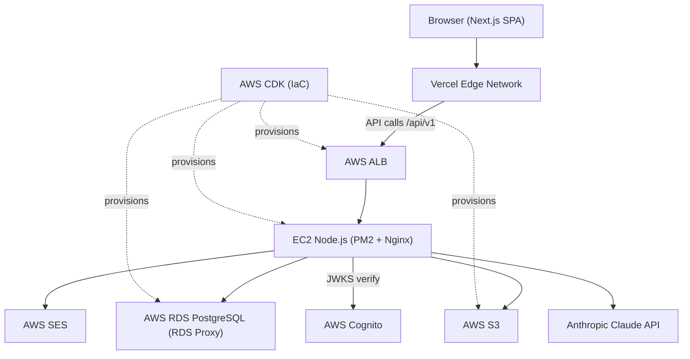

# RegAxis RIM — Regulatory Information Management, powered by AI — from submission to approval, all in one place.

## What This Is

RegAxis RIM is a multi-tenant SaaS platform for pharmaceutical, biotech, and medical device Regulatory Affairs teams. It centralises the full regulatory lifecycle — registrations, renewals, submissions, dossiers, labeling, and AI-powered analytics — into a single system, replacing fragmented spreadsheets and disconnected trackers. The platform enforces 21 CFR Part 11 / GxP audit trail requirements and provides real-time visibility across global regulatory portfolios.

## Document Index

| Document | Purpose | Audience |
|---|---|---|
| `idea.md` | App concept, problem statement, core features | All |
| `prototype-notes.md` | UX decisions from prototype phase | Designers, PMs |
| `requirements/business-requirements.md` | Business objectives, user personas, user stories | PMs, stakeholders |
| `requirements/technical-requirements.md` | Functional + non-functional requirements | Engineers |
| `requirements/feature-requirements.md` | Acceptance criteria per feature | Engineers, QA |
| `requirements/test-requirements.md` | Test strategy, coverage targets, E2E scenarios | QA, engineers |
| `requirements/marketing-requirements.md` | GTM, positioning, analytics | Marketing |
| `tech-stack.md` | Final stack decisions, environment tier model | Engineers |
| `design/frontend-design.md` | Component architecture, routing, state management | Frontend engineers |
| `design/backend-design.md` | API design, service adapters, RBAC | Backend engineers |
| `design/database-design.md` | ERD, table definitions, migration strategy | Engineers, DBAs |
| `design/api-contract.md` | Full OpenAPI-style endpoint reference | Engineers, integrators |
| `architecture.md` | System overview, topology diagrams, ADRs | Engineers, architects |
| `docs/quickstart.md` | Get the app running in 5 minutes | New developers |
| `docs/local-setup.md` | Full local development guide | Engineers |
| `docs/production-setup.md` | Deployment, secrets, monitoring, rollback | DevOps, engineers |

## Architecture at a Glance



**Stack summary:**

| Layer | Technology |
|---|---|
| Frontend | Next.js 15 (App Router), TypeScript, Tailwind CSS, TanStack Query v5 |
| Backend | Express/Node.js 20 on AWS EC2 (PM2 + Nginx) |
| Database | PostgreSQL 16 via AWS RDS (RDS Proxy for connection pooling) |
| Auth | AWS Cognito — JWT tokens verified via JWKS on every request |
| Storage | AWS S3 — presigned URLs; file bytes never transit the backend |
| Email | AWS SES — transactional (renewal alerts, submission milestones) |
| AI | Anthropic Claude API — dossier gap analysis, Copilot chat, renewal package generation |
| Cache | AWS ElastiCache Redis — rate-limit counters, AI response memoisation |
| Monorepo | Turborepo — `apps/web`, `apps/api`, `packages/types`, `infra/` |
| IaC | AWS CDK (TypeScript) under `infra/` |

## Quick Links

- [Quickstart](docs/quickstart.md) — get the app running in 5 minutes
- [Local Setup](docs/local-setup.md) — full local development guide
- [Production](docs/production-setup.md) — deployment, secrets, monitoring, rollback
- [Architecture](architecture.md) — system overview, topology diagrams, ADRs
- [API Contract](design/api-contract.md) — full endpoint reference

## Contributing

### Branch naming

- Features: `feature/<slug>` (e.g. `feature/renewal-calendar`)
- Bug fixes: `fix/<slug>` (e.g. `fix/dossier-upload-timeout`)

### Pull request expectations

- All CI checks must pass before a PR can be merged: lint (`turbo lint`), typecheck (`turbo typecheck`), and the full unit test suite (34 tests via Vitest).
- PRs are squash-merged to `main`.
- The PR description must summarise the change and link to the relevant task or issue.

### Commit messages

Follow the [Conventional Commits](https://www.conventionalcommits.org/) format:

```
feat: add renewal calendar dashboard
fix: correct tenant isolation in dossier repository
chore: upgrade pg to v8.13
```

Allowed prefixes: `feat`, `fix`, `chore`, `docs`, `refactor`, `test`, `ci`, `perf`.

## License

MIT
