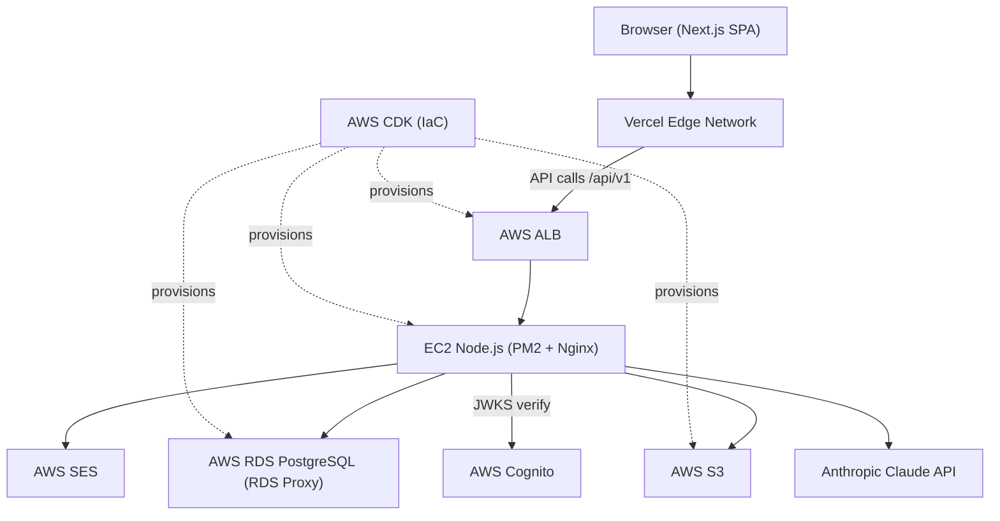
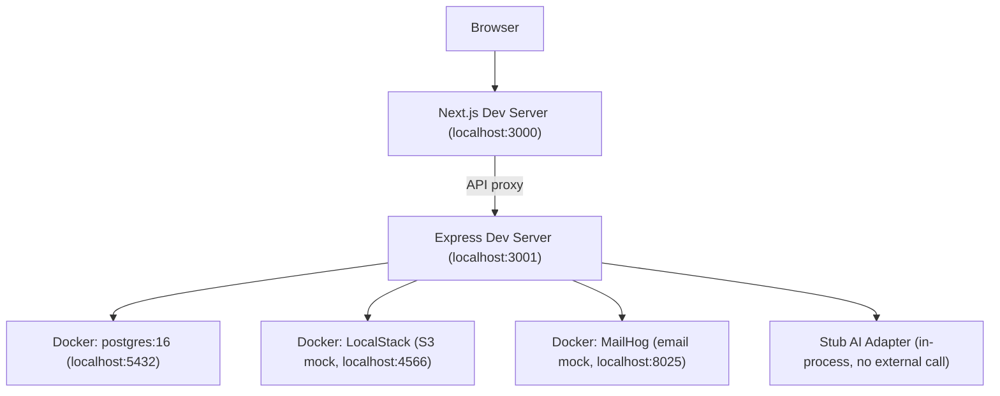
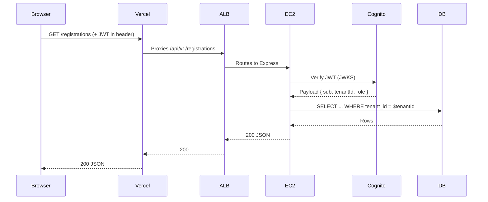
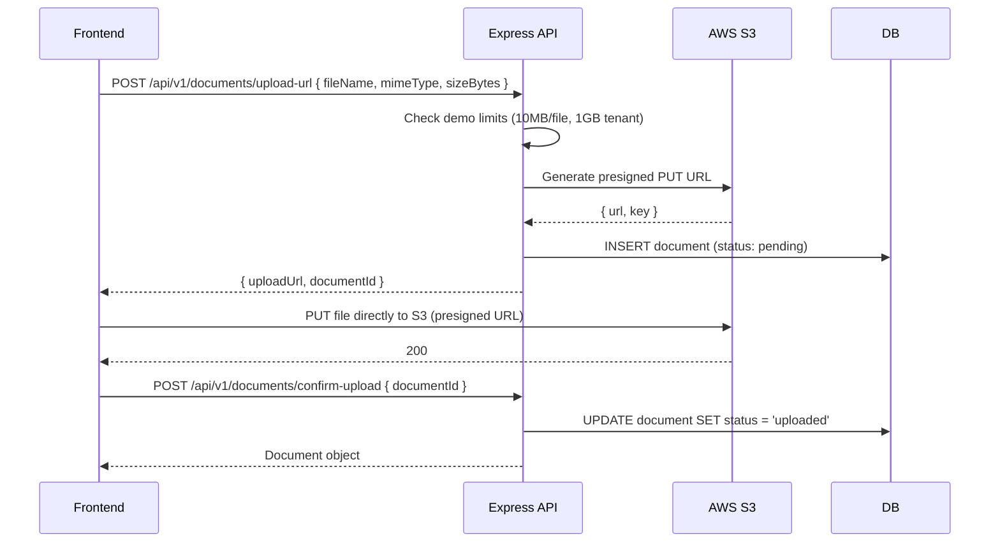

# RegAxis RIM — Architecture Document

Version: 1.0
Date: 2026-05-05
Status: Approved

---

## 1. System Overview

RegAxis RIM is a multi-tenant SaaS platform built as a three-tier web application. The browser loads a Next.js 15 App Router frontend deployed to Vercel's global edge network; API requests are proxied through Vercel to an AWS Application Load Balancer (ALB) which routes traffic to Express/Node.js processes running under PM2 on EC2. Shared TypeScript types live in a `packages/types` library inside a Turborepo monorepo that also houses the AWS CDK infrastructure code under `infra/`. Data is persisted in AWS RDS PostgreSQL 16 accessed via RDS Proxy for connection multiplexing; AI features (dossier gap analysis, HA query drafting, renewal package generation, Copilot chat) are powered by the Anthropic Claude API called exclusively from the backend. Identity and access management is handled by AWS Cognito with JWT tokens verified on every API request via JWKS. Documents are stored in AWS S3 using presigned URLs so file bytes never pass through the application server. Transactional email (renewal alerts, submission milestones, HA query notifications) is dispatched via AWS SES. ElastiCache Redis provides rate-limit counters and AI response caching in demo and production tiers.

---

## 2. Production Architecture Diagram



---

## 3. Local Development Topology

All local services are started via `docker-compose.yml`. Setting `APP_ENV=local` causes `lib/services.ts` to wire stub and mock adapters in place of real AWS services — no AWS credentials are required.



---

## 4. Environment Tier Overview

All environment branching is encapsulated in exactly two files — `apps/api/src/lib/config.ts` (sole reader of `process.env`, Zod-validated at startup) and `apps/api/src/lib/services.ts` (adapter factory). No handler, service, or repository file reads `process.env` or branches on `APP_ENV` directly.

| Dimension | local | demo | production |
|-----------|-------|------|------------|
| Frontend | localhost:3000 (next dev) | Vercel preview URL | Vercel production domain |
| Backend | localhost:3001 (ts-node-dev) | EC2 t3.small, single AZ | EC2 t3.medium+, Multi-AZ via ALB |
| Database | Docker PostgreSQL | RDS PostgreSQL t3.micro, 5 conn | RDS PostgreSQL r6g.large, full pool |
| Auth | Hard-coded test JWT or LocalStack Cognito | Real Cognito (demo user pool) | Real Cognito (production user pool) |
| Storage | LocalStack S3 | Real S3 (capped) | Real S3 (production) |
| Email | MailHog (console visible at :8025) | SES sandbox | SES production |
| AI | Stub adapter (canned responses) | Real Anthropic (rate-limited) | Real Anthropic (full quota) |
| Cache | None (Map in-process) | ElastiCache Redis t3.micro | ElastiCache Redis r6g |

---

## 5. Request Lifecycle

The following diagram shows a complete authenticated API request from browser to database and back.



Key enforcement points:
- `middleware/auth.ts` — extracts the Bearer token, verifies signature via Cognito JWKS (keys cached 1 hour in-process), attaches decoded payload to `req.user`.
- `middleware/tenant.ts` — reads `custom:org_id` from the verified JWT and attaches it to `req.tenant`. The `tenantId` is never sourced from the request body or query string.
- Repositories — every query includes `WHERE tenant_id = $1` with `tenantId` injected from `req.tenant.id`. Cross-tenant data leakage is structurally prevented.

---

## 6. Monorepo Structure

The repository is a Turborepo workspace with shared build cache and parallel task execution.

```
/
├── apps/
│   ├── web/                    Next.js App Router frontend
│   │   ├── src/
│   │   │   ├── app/            Routes & layouts
│   │   │   ├── components/     ui/, layout/, [module]/
│   │   │   ├── services/       API fetch hooks (TanStack Query)
│   │   │   ├── lib/            Utilities, formatters
│   │   │   └── types/          Re-exports from packages/types
│   │   ├── public/
│   │   ├── tailwind.config.ts
│   │   └── package.json
│   └── api/                    Express Node.js backend
│       ├── src/
│       │   ├── handlers/       Route handlers (one file per resource)
│       │   ├── services/       Business logic
│       │   ├── repositories/   SQL queries
│       │   ├── middleware/     auth, tenant, error, rate-limit
│       │   ├── lib/
│       │   │   ├── config.ts   Zod env validation
│       │   │   └── services.ts External service factory
│       │   └── index.ts        App bootstrap
│       ├── migrations/         SQL migration files
│       ├── seeds/              Seed data
│       └── package.json
├── packages/
│   └── types/                  Shared TypeScript types
│       ├── src/
│       │   ├── entities.ts     Domain entity types
│       │   ├── api.ts          Request/response DTOs
│       │   └── index.ts
│       └── package.json
├── infra/                      AWS CDK stacks
│   ├── lib/
│   │   ├── vpc-stack.ts
│   │   ├── rds-stack.ts
│   │   ├── ec2-stack.ts
│   │   └── cognito-stack.ts
│   └── package.json
├── docker-compose.yml          Local dev services
├── turbo.json                  Turborepo pipeline config
├── package.json                Root workspace
└── .env.example                All required env vars (APP_ENV first)
```

### Backend layer rule

Imports flow strictly downward; no layer may import from a layer above it:

```
handlers → services → repositories → DB
```

- **Handlers** — parse and Zod-validate request input; delegate to services; return HTTP responses. No business logic, no direct DB access.
- **Services** — orchestrate business rules; call repositories and external adapters. No raw SQL, no `process.env` access.
- **Repositories** — execute parameterised SQL via `pg.Pool`; map snake_case columns to camelCase; no conditional business logic.
- **DB** — a single `pg.Pool` created in `lib/services.ts` and injected into all repositories.

---

## 7. Data Flow: Document Upload

Documents are uploaded directly to S3 via presigned URLs. File bytes never transit the Express process.



S3 keys follow the pattern `{tenant_id}/{entity_type}/{entity_id}/{uuid}/{filename}`. Presigned GET URLs expire after 15 minutes. In production the bucket uses SSE-KMS encryption at rest; in demo it uses SSE-S3. The bucket policy blocks all public access in both tiers.

---

## 8. CI/CD Pipeline

The pipeline is implemented as a GitHub Actions workflow.

### On pull request
1. **Lint** — ESLint across all workspaces (`turbo lint`)
2. **Type-check** — TypeScript strict mode (`turbo typecheck`)
3. **Unit tests** — Vitest against `apps/web` and `apps/api`
4. **Integration tests** — Vitest against a Docker-managed `rim_test` PostgreSQL database (migrated and seeded before the run)
5. **E2E tests** — Playwright against the Vercel preview deployment (auto-provisioned per branch by Vercel)
6. **Dependency scan** — `npm audit` (fails on high/critical CVEs)

### On merge to main
1. **Build** — `turbo build` (frontend and backend)
2. **Deploy frontend** — Vercel production deployment (triggered automatically via Vercel GitHub integration)
3. **Deploy backend** — SSH to EC2 (or AWS CodeDeploy) to pull the new build, run `npm ci --omit=dev`, and restart PM2
4. **Run migrations** — `npm run migrate` against the production RDS instance as a pre-deploy step on EC2 (idempotent, reversible)

---

## 9. Security Architecture

### Network isolation
- All inter-service calls stay within the AWS VPC. EC2 communicates with RDS and ElastiCache across private subnets; neither service has a public endpoint.
- EC2 instances have no public IP address and are only reachable through the ALB.
- The ALB terminates TLS (HTTPS). HTTP traffic is redirected to HTTPS. A WAF is attached in production.

### Authentication and authorization
- Every protected route runs `middleware/auth.ts`, which verifies the Cognito JWT signature against the JWKS endpoint; the public key is cached in-process for 1 hour.
- `middleware/tenant.ts` extracts `custom:org_id` from the verified token — the `tenantId` is never sourced from user-supplied input.
- `middleware/rbac.ts` applies role checks (`requireRole([ ... ])`) at the router level. Roles: `super_admin`, `regulatory_lead`, `regulatory_affairs_manager`, `regulatory_affairs_specialist`, `dossier_manager`, `submission_coordinator`, `labeling_specialist`, `read_only`, `external_reviewer`.
- Row-level tenant isolation is enforced structurally: every repository query includes `WHERE tenant_id = $1`.

### Database
- RDS is in a private subnet with no public access.
- The application database role (`rims_app`) holds `SELECT, INSERT, UPDATE, DELETE` on all tables except `audit_log`, where only `INSERT` is granted. `UPDATE` and `DELETE` on `audit_log` are explicitly revoked, enforcing append-only immutability at the database level (21 CFR Part 11 / TR-C-003).
- Database credentials are stored in AWS Secrets Manager and rotated on a schedule.
- All SQL queries use parameterised `pg` placeholder syntax. Raw string interpolation into SQL is prohibited.

### Storage
- The S3 bucket policy blocks all public access in every tier.
- Files are accessed exclusively via presigned URLs generated by the Express backend. Presigned GET URLs expire after 15 minutes.
- Production bucket encryption: SSE-KMS. Demo bucket: SSE-S3.

### Application hardening
- `helmet()` applied globally: `X-Frame-Options: DENY`, `Content-Security-Policy`, `Strict-Transport-Security` (demo and production), `X-Content-Type-Options: nosniff`.
- CORS `origin` is a strict allowlist (Vercel domain only in demo/production; never `*`).
- Rate limiting via `express-rate-limit`: 10 failed auth attempts per IP per 15 minutes; 60 Copilot requests per org per hour; 300 general requests per IP per minute.
- All request bodies and query parameters are validated against Zod schemas in the handler layer; unknown keys are stripped before reaching services.
- Secrets are stored in AWS Secrets Manager or injected as runtime environment variables. No secrets are committed to the repository (enforced by `.gitignore` and CI secret scanning).
